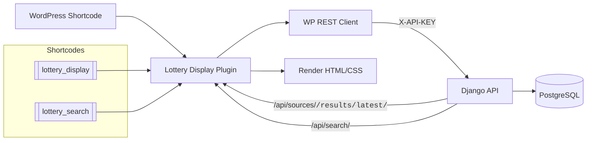

# Lottery Display Plugin

A production-ready WordPress plugin that renders lottery results from a Django backend with secure API access, rich layouts, and a built-in search experience.

## Highlights

- Django REST integration with API key security.
- Two shortcodes: latest results + number search.
- Thai-friendly UI with configurable labels.
- Admin display settings with live CSS generation.
- `wp-env` ready for local development.

## What It Does

- `[lottery_display]` renders the latest results for a lottery source.
- `[lottery_search]` lets users verify a 6-digit number against a draw date.
- All data is fetched from the `lottery-platform` API.

## Tech Stack

- WordPress (PHP)
- Django REST API
- PostgreSQL
- Docker + `wp-env`

## Requirements

- WordPress environment (local or production)
- Django API running and reachable
- API key configured

## Configuration

Edit `config.php`:

- `LOTTERY_API_BASE_URL` (example: `http://localhost:8000`)
- `LOTTERY_API_KEY` (must match `API_AUTH_KEY` in Django `.env`)

If WordPress runs in WSL, `localhost` points to WSL. Use the Windows host IP for the API base URL.

## Shortcodes

- ` [lottery_display type="huayrat_display"] `
  - Uses source -> Thai display name mapping from `assets/json/column_mapping.json`.
- ` [lottery_search] `
  - Pulls draw dates from the API and searches with correct front/back/last digit rules.

## API Endpoints Used

- `GET /api/sources/<code>/results/latest/`
- `GET /api/draw-events/?source=huayrat&status=completed&page_size=10`
- `GET /api/search/?source=huayrat&draw_date=YYYY-MM-DD&number=123456`

All requests require `X-API-KEY: <key>`.

## Display Settings

Admin: **Settings -> Lottery Display**

- Layout colors, borders, and typography
- Generates:
  - `assets/css/core-style.css`
  - `assets/css/layout-huayrat.css`
  - `assets/css/layout-default.css`

Reset to default removes generated files and recreates them.

## Local Testing (wp-env)

From plugin root:

```powershell
npx @wordpress/env start
```

Stop:

```powershell
npx @wordpress/env stop
```

## Project Structure

- `config.php` - API base URL + key
- `includes/api.php` - REST client
- `includes/display.php` - rendering logic + source label map
- `shortcode/main-lottery.php` - latest results
- `shortcode/search.php` - search UI + AJAX
- `assets/json/column_mapping.json` - reward labels + source display names
- `.wp-env.json` - local WordPress container

## Flow



## Status

Stable for local testing with Docker + `wp-env`. Ready for production once API URL and key are set.

## Changelog

See `CHANGELOG.md`.